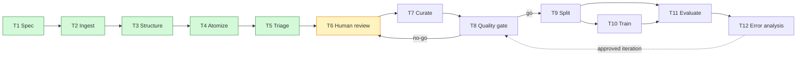
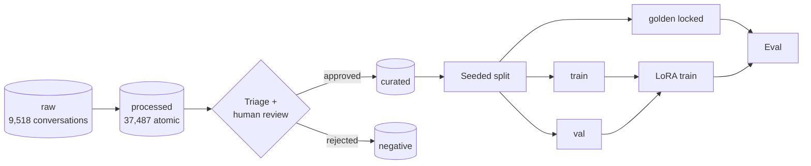

# Healthcare Support LLM

> **Research only — not for clinical use.** This repository builds a *dataset
> curation and evaluation pipeline* for a conversational medical small-language-model
> experiment. Nothing here is a medical device, and no model trained from it
> should be used for diagnosis or treatment.

A curation-to-evaluation pipeline that turns raw doctor–patient conversations
into quality-controlled training data: normalize → atomize into single-issue
examples → rules-based triage → human review → curated/negative stores →
seeded splits → LoRA fine-tuning → golden-set evaluation. Every stage is
deterministic, content-hashed, and guarded by an executable gate.

**Status:** T1–T5 complete (2026-10-05), T6 (human review tooling) active.
See [Status](#status).

## Pipeline





More views (system architecture, review flow, training flow, provenance):
[diagrams/diagrams.md](diagrams/diagrams.md). Normative contracts:
[SPEC.md](SPEC.md), [workflow](docs/workflow/t1-t12-workflow.md),
[data contract](docs/data/data-contract.md),
[curation strategy](docs/data/curation-strategy.md).

## Quickstart

Prerequisites: Python 3.11 and [uv](https://docs.astral.sh/uv/).

```bash
git clone https://github.com/arifanony/healthcare-support-llm.git
cd healthcare-support-llm
uv sync
```

### 1. Download the raw data

Datasets are **not** committed (see [Data](#data)). Download both files into
`data/raw/` with exactly these names, then verify hashes against the
committed manifest:

| File | Source | Rows | SHA-256 (prefix) |
|---|---|---|---|
| `iCliniq.json` | [ChatDoctor mirror](https://github.com/AbdelAbys/ChatDoctor) (also HF `lavita/ChatDoctor-iCliniq`) | 7,321 | `e9860b37…` |
| `opusdiseaseconversations.jsonl` | [HF `nisten/opus-doctor-patient-conversations-all-human-diseases`](https://huggingface.co/datasets/nisten/opus-doctor-patient-conversations-all-human-diseases) | 2,197 | `a28a7912…` |

```bash
uv run python scripts/verify_manifest.py   # must print "raw store OK"
```

(`scripts/build_manifest.py` regenerates `data/raw/MANIFEST.json` from whatever
is in `data/raw/` and marks the files read-only; run it only if you
re-download.)

### 2. Run the pipeline (T3–T5)

Each stage is deterministic — re-running reproduces byte-identical outputs —
and each has a gate script that proves it:

```bash
# T3: normalize to conversation/v1 (9,518 conversations, 0 quarantined)
uv run python src/structuring/normalize.py
uv run python scripts/check_structured.py

# T4: extract atomic single-issue examples (37,487; 50-record spot-check)
uv run python src/curation/extract.py
uv run python scripts/check_atomic.py

# T5: rules triage (ACCEPT 18,096 / REVIEW 19,383 / REJECT 8)
cd src && uv run python -m curation.triage; cd ..
# ...grade data/processed/calibration_sample.json (100 records, see below)...
cd src && uv run python -m curation.triage; cd ..   # fills agreement
uv run python scripts/check_triage.py               # ~4 min
```

Triage config (rubric, lexicons, thresholds, model id): [configs/triage.yaml](configs/triage.yaml).

### 3. Calibration (AC-T5-2)

`triage` writes `data/processed/calibration_sample.json`: 100 blind records
sampled across verdict strata. A human sets `human_verdict` on each, then the
rebuild above measures triage↔human agreement into `triage_report.json`.
Current report is agent-graded (`grader: agent`, 54/100) under a recorded
human waiver ([DECISION-325e3181](.genesis/project.json)) — a real human
calibration can still supersede it at any time by filling `human_verdict`.

## Repo layout

```text
src/
  structuring/normalize.py   T3: raw -> conversation/v1 (+ quarantine)
  curation/extract.py        T4: conversations -> atomic/v1 examples
  curation/triage.py         T5: deterministic rules triage + report + sample
  ingestion/ review/ splitting/ training/ evaluation/   (T6+ stubs)
configs/triage.yaml          triage rubric, lexicons, model/prompt ids
scripts/                     one executable gate per stage + manifest tools
data/                        stores (gitignored except manifests + small reports)
docs/                        workflow, data contracts, decisions (ADRs), safety
diagrams/diagrams.md         mermaid sources (architecture, flows, provenance)
experiments/                 run records (populated from T10 on)
.genesis/                    build harness state: tasks, gates, evidence, decisions
```

## Data

| Store | Content | Format |
|---|---|---|
| `data/raw/` | 9,518 source conversations, write-once, SHA-256 manifest | `iCliniq.json`, `opusdiseaseconversations.jsonl` |
| `data/processed/` | normalized conversations, atomic examples, triage verdicts, report, calibration sample | `conversations.jsonl`, `atomic.jsonl`, `triaged.jsonl`, `triage_report.json`, … |
| `data/curated/`, `data/negative/` | T7 outputs (pending T6 review) | atomic/v1 + review decisions |
| `data/splits/`, `data/golden/` | T9 outputs (pending) | seeded train/val + locked golden |

Only manifests and small reports (`triage_report.json`,
`calibration_sample.json`, `spotcheck_T4.md`) are committed — the `*.jsonl`
stores (up to ~280 MB) stay local and rebuild via [Quickstart](#quickstart).
Every record carries `parent_ids`/`history` provenance; see the
[data contract](docs/data/data-contract.md).

## Triage rubric (T5)

`rules-triage/v1` scores 11 dimensions 1–5 (higher is better) and routes:

- **REJECT** — acute emergency or self-harm mishandled on forum data, toxic
  language; reasons use only the controlled §7 vocabulary, e.g.
  `[unsafe_response] …`
- **REVIEW** — any dimension ≤ 2, PII pattern, or subacute emergency mention
- **ACCEPT** — everything else, with dimension scores + rationale recorded

Rules lean safe by design (calibration: 42 of 46 disagreements were
rules-REVIEW vs agent-ACCEPT); only T6 human decisions move records into
stores. Full rubric: [curation strategy](docs/data/curation-strategy.md).

## Gates

| Task | Gate | Command | Notes |
|---|---|---|---|
| T2 | `verify-manifest` | `uv run python scripts/verify_manifest.py` | hashes files vs manifest |
| T3 | `check-structured` | `uv run python scripts/check_structured.py` | schema + byte-identical re-run |
| T4 | `check-atomic` | `uv run python scripts/check_atomic.py` | parent links + 100% coverage + re-run |
| T5 | `check-triage` | `uv run python scripts/check_triage.py` | verdicts + vocabs + agreement + re-run |
| T5 | (harness) | `genesis gate . T5-1 --timeout 600000` | ~4 min; default 120 s budget too small |

Older gates' manifest byte-comparison legitimately goes red as later stages
extend the store (documented in `extract.py` / `triage.py`); in-order
re-execution stays green.

## Status

| Stage | State |
|---|---|
| T1 spec + ADRs + diagrams | done (human-approved 2026-09-30) |
| T2 ingestion (9,518 convos) | done |
| T3 structuring | done |
| T4 atomic extraction (37,487) | done |
| T5 triage + calibration | done (agent-graded; human calibration waived, may still run) |
| T6 review tooling | **active** |
| T7–T12 | queued |

Live task/gate state with proof artifacts: [.genesis/](.genesis/)
(`PLAN.md`, `project.json`, `evidence/`).

## Safety & license

- Research-only, non-clinical, non-commercial use. No model from this
  pipeline is safe for patient care; see [safety](docs/safety/safety-risk-note.md)
  and [threat model](docs/safety/threat-model-lite.md).
- Upstream data: Opus conversations (MIT); iCliniq (academic-research-only,
  non-commercial — respect its terms if you redistribute derived data).
- No `LICENSE` file is set yet; add one (e.g. Apache-2.0 for code) before
  inviting contributors.
