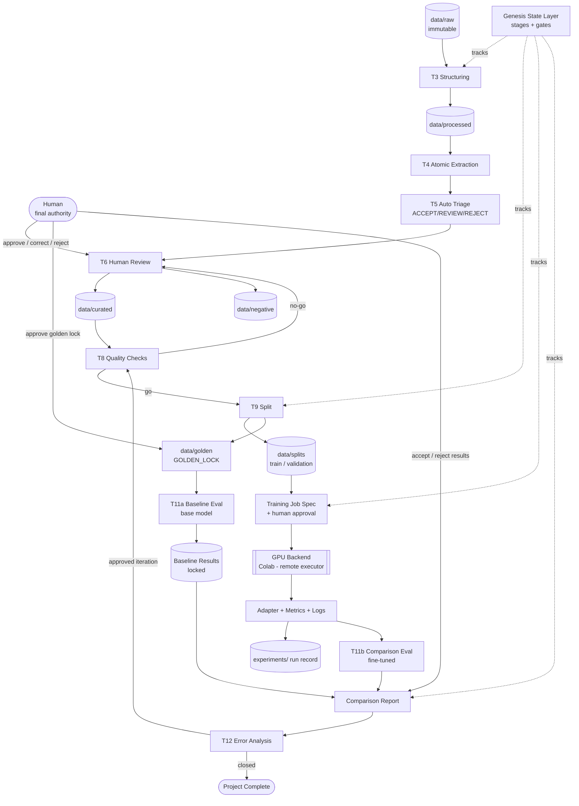
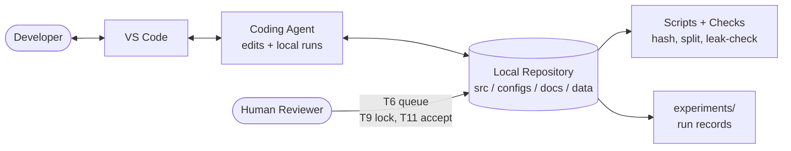
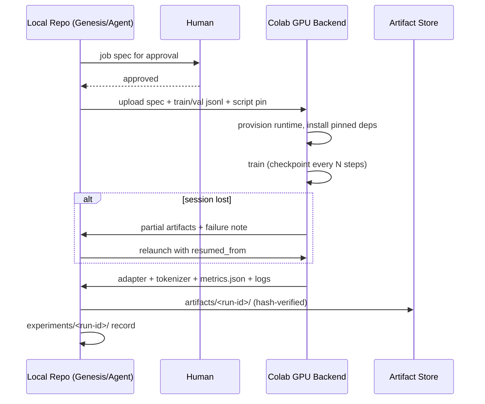
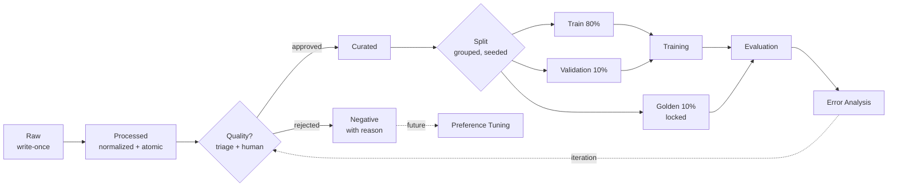
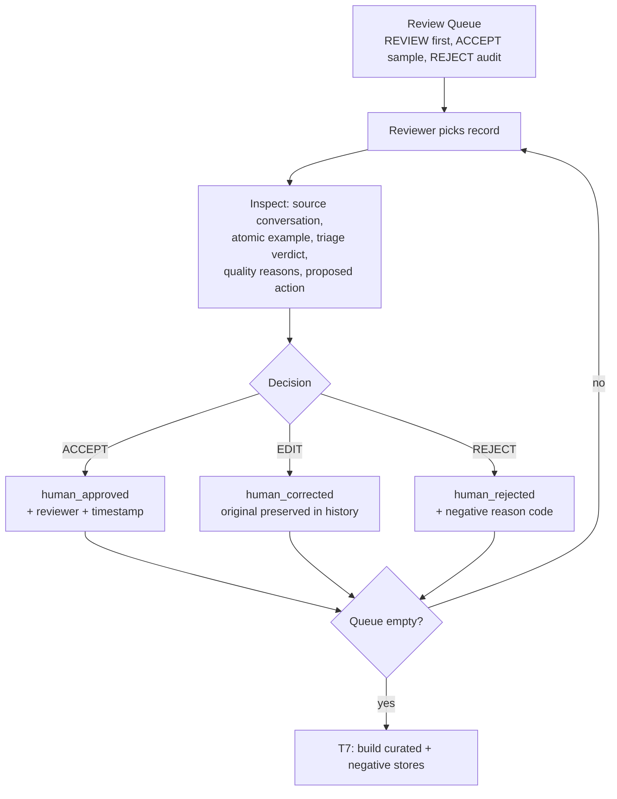
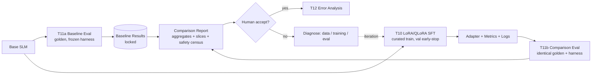
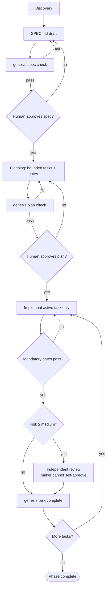
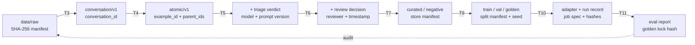

# Diagrams

Version-controlled Mermaid sources. Render in any Mermaid-compatible viewer
(GitHub, VS Code extensions, mermaid.live).

## 1. System architecture

## 5a. Local development environment

## 5b. Local ↔ remote GPU execution

## 2. Data lifecycle

## 3. Human review flow (T6)

## 4. Model training / evaluation flow

## 6. Genesis state / workflow flow

## 7. Provenance flow

